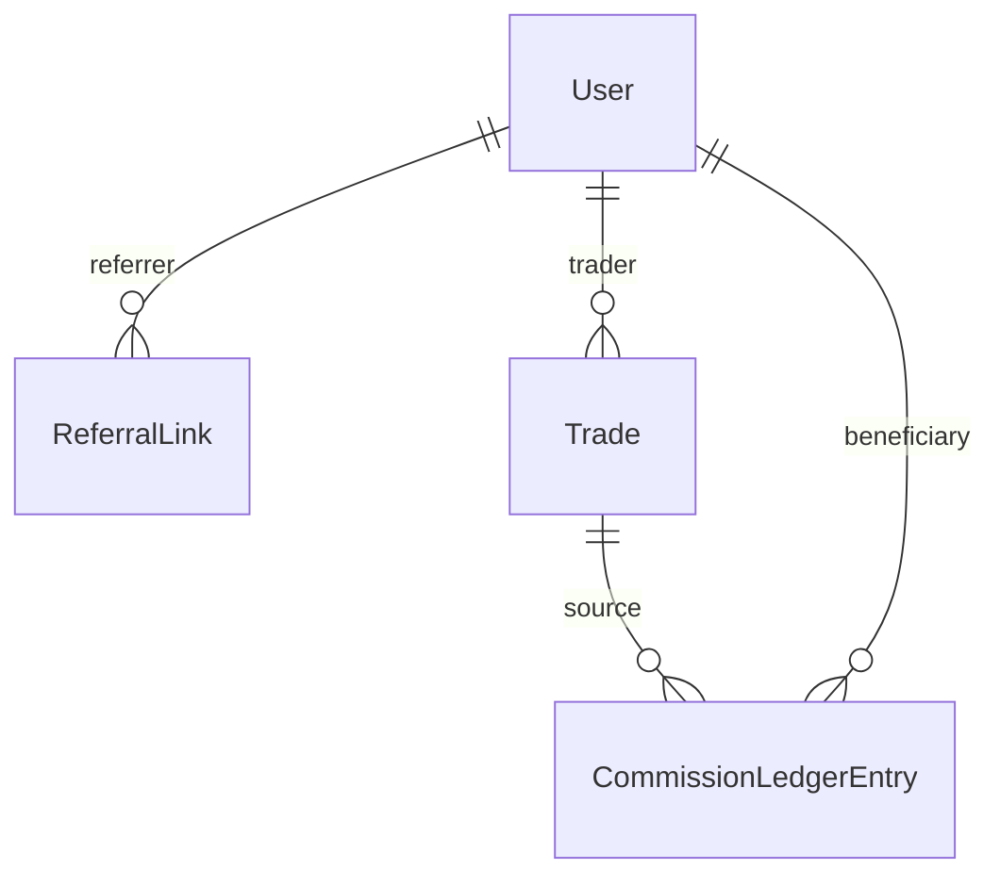

# Referral System (DDD + Hex + CQRS) — Monorepo

This repo contains:
- Backend: NestJS + Prisma (Postgres)
- Frontend: Next.js (TypeScript, Tailwind)
- Domain: DDD-lite with Hexagonal Ports/Adapters and Strategy for commission policy

## TL;DR (Quick Start)

1) Start Postgres (Podman or Docker)
- We already started with Podman once. If needed, run:
```
podman run --name referral_postgres -e POSTGRES_USER=postgres -e POSTGRES_PASSWORD=postgres -e POSTGRES_DB=referral -p 5432:5432 -d docker.io/library/postgres:16-alpine
```

2) Backend setup
```
cd referral-service
cp .env .env.local 2>/dev/null || true
# Ensure DATABASE_URL is set in .env
npm i
npx prisma migrate dev -n init
npm run start:dev
```
- Base URL: http://localhost:3000
- Auth: use header `x-user-id: <USER_ID>` (demo guard)

3) Frontend setup
```
cd ../frontend
npm i
# Point to backend
echo 'NEXT_PUBLIC_API_BASE_URL=http://localhost:3000' > .env.local
npm run dev
```
- Open the printed dev URL
- In dev console, set your UserId: `localStorage.setItem('x-user-id','<USER_ID>')`

## Architecture

- Domain rules:
  - 3 referral levels with commission rates 30% / 3% / 2%
  - Optional user cashback (e.g. 10% of fee)
  - Depth ≤ 3, no cycles, referrer link immutable once set
  - Idempotency per (beneficiaryId, tradeId, level)
- Hexagonal (Ports & Adapters):
  - Ports: UserRepository, ReferralRepository, LedgerRepository, IdempotencyStore, TradesRepository
  - Adapters: Prisma-based repositories
- CQRS:
  - Writes: small transactional flows (register link, process trade → ledger entries)
  - Reads: fast queries for network and earnings
- Strategy:
  - `DefaultPolicy` implements cashback + 30/3/2 splits, pluggable for future tiers

## Repo Layout
```
.
├─ referral-service/                 # NestJS backend (DDD/Hex)
│  ├─ prisma/                        # Prisma schema & migrations
│  ├─ src/
│  │  ├─ domain/                     # Entities, VOs, policies, domain services
│  │  ├─ application/                # Ports, tokens, app services
│  │  ├─ infrastructure/prisma/      # Prisma service + repository adapters
│  │  └─ interfaces/http/            # Controllers, DTOs, modules
│  └─ test/                          # e2e config (placeholder)
└─ frontend/                         # Next.js app
   └─ src/
      ├─ application/                # FE ports/adapters/providers/hooks
      └─ lib/                        # API client
```

## Data Model (Essentials)

- User(id, email, referralCode?, feeCashbackRate)
- ReferralLink(referrerId, refereeId, level)
- Trade(id, userId, feeAmount)
- CommissionLedgerEntry(beneficiaryId, sourceTradeId, level, rate, amount, token)
- IdempotencyKey(key)

Mermaid (high-level):
```

```

## Backend API

Auth: header `x-user-id` is required.

- POST /api/referral/generate
  - Resp: `{ code: string }`

- POST /api/referral/register
  - Body: `{ code: string }`
  - Resp: `{ level: number }`

- GET /api/referral/network
  - Resp: `{ level1: string[], level2: string[], level3: string[] }`

- GET /api/referral/earnings
  - Resp: `{ total: string|number, byLevel: { 0?:number, 1?:number, 2?:number, 3?:number } }`

- DEV: POST /api/trades/mock
  - Body: `{ tradeId: string, userId: string, feeAmount: number, token?: string }`
  - Resp: `{ ok: true }`

### Curl Examples
```
# Generate code
curl -H 'x-user-id: U1' -X POST http://localhost:3000/api/referral/generate

# Register with code (set U2 as current user)
curl -H 'x-user-id: U2' -H 'content-type: application/json' -d '{"code":"ref_U1"}' \
  http://localhost:3000/api/referral/register

# Network
curl -H 'x-user-id: U1' http://localhost:3000/api/referral/network

# Earnings
curl -H 'x-user-id: U1' http://localhost:3000/api/referral/earnings

# Mock trade (execute as user U2, fee 100 XP)
curl -H 'x-user-id: U2' -H 'content-type: application/json' \
  -d '{"tradeId":"t1","userId":"U2","feeAmount":100,"token":"XP"}' \
  http://localhost:3000/api/trades/mock
```

## Frontend

- Set API base URL in `frontend/.env.local`:
```
NEXT_PUBLIC_API_BASE_URL=http://localhost:3000
```
- Set the dev user id in the browser console:
```
localStorage.setItem('x-user-id','U1')
```
- Pages:
  - `/referral` Generate/copy code
  - `/referral/register` Input invite code
  - `/referral/network` 3-level tree
  - `/referral/earnings` Summary totals

## Testing

Backend unit tests:
```
cd referral-service
npm test
```
- Covered: Money VO, Percentage VO, DefaultPolicy, CommissionService, ReferralService, ReferralAppService, TradesAppService

e2e tests: to be added next (supertest against controllers).

## Notes vs Assessment (content.pdf)
- Business: 30/3/2 tiers, depth≤3, no cycles, idempotency — implemented
- Technical: Prisma schema, endpoints, error handling, rate limit/logging — implemented
- Extensibility: Strategy for commission policy, Ports/Adapters for future distributor/outbox — designed and stub-friendly

## Troubleshooting
- Postgres connection: ensure container is running and `DATABASE_URL` points to it
- Auth: remember `x-user-id` header
- DTO errors: 400 with `{ code: 'HTTP_ERROR', message }`

## License
UNLICENSED (internal assessment project)
# NikaTest
